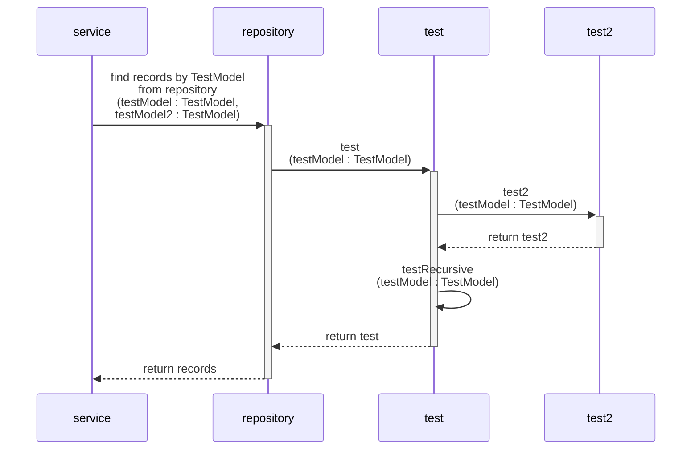

```mermaid
sequenceDiagram
service ->>+ repository: find records by TestModel <br>from repository <br>(testModel : TestModel, <br>testModel2 : TestModel)
repository ->>+ test: test <br>(testModel : TestModel)
test ->>+ test2: test2 <br>(testModel : TestModel)
test2 -->>- test: return test2
test ->> test: testRecursive <br>(testModel : TestModel)
test -->>- repository: return test
repository -->>- service: return records
```